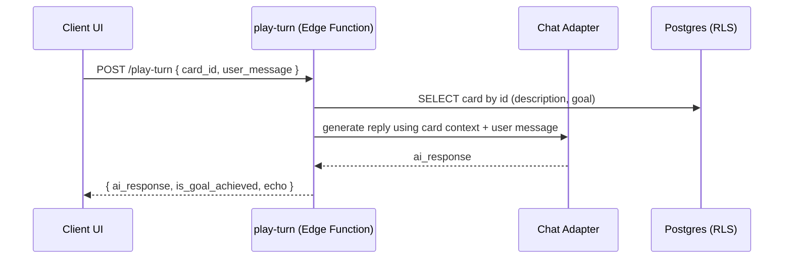

# Architecture Brief (Demo-Adapted)

This document presents the architectural principles and components of Playable Character Cards, adapted for a static, non-running demo repository. It explains the system design and patterns without including operational commands or secrets.

---

## 1) High-Level Architecture

```mermaid
graph TB
    subgraph "Frontend Applications (Examples)"
        FE1[Therapy UI]
        FE2[Education UI]
        FE3[Storytelling UI]
    end

    subgraph "Edge Functions (Conceptual)"
        API1[get-public-cards]
        API2[get-card-details]
        API3[play-turn]
    end

    subgraph "AI Integration Layer"
        AD1[Chat Adapter (Gemini)]
        AD2[Image Adapter (Imagen)]
    end

    subgraph "Data Layer"
        DB[(PostgreSQL + RLS)]
        ST[Storage]
    end

    FE1 --> API1
    FE2 --> API2
    FE3 --> API3
    
    API1 --> DB
    API2 --> DB
    API3 --> DB
    API3 --> AD1
    AD2 --> ST
```

Key principles:
- Stateless, function-per-endpoint design
- Strong separation between API contracts and AI providers
- Public read paths via RLS; admin writes via separate, secured endpoints (not shown here)

---

## 2) Core Data Flow (Play Turn)



Notes:
- Goal evaluation happens alongside the AI response (string matching/heuristics configured per card design).
- The function remains stateless; the client carries conversation context if needed.

---

## 3) AI Adapter Pattern (Conceptual)

Rationale:
- Encapsulate provider-specific logic (auth, prompts, parsing, retries) behind stable interfaces.
- Enable provider/model swaps without touching business logic.

Adapter sketch:
```ts
// Chat adapter interface (illustrative)
interface ChatPrompt {
  system: string;
  messages: Array<{ role: 'user' | 'assistant'; content: string }>;
}

interface ChatResponse { content: string }

async function getChatCompletion(prompt: ChatPrompt): Promise<ChatResponse> {
  // Provider-specific implementation (e.g., Gemini)
  // - retries, timeouts, validation
  // - safe parsing and normalization
  return { content: "..." };
}
```

Image adapter responsibilities (illustrative):
- Decode provider output (e.g., Base64 to bytes)
- Resize 1024x1024 → 512x512
- Encode JPEG with target quality
- Return buffer suitable for storage upload

---

## 4) Endpoint Contracts (Quick Glance)

Full details in docs/api/SPEC.md. Shapes summarized here for context.

Cards list (GET /get-public-cards):
```json
{
  "items": [
    { "id": "123", "description": "...", "goal": "...", "image_url": "..." }
  ],
  "page": 1,
  "pageSize": 20,
  "total": 100
}
```

Card details (GET /get-card-details?id=...):
```json
{ "id": "123", "description": "...", "goal": "...", "image_url": "..." }
```

Play turn (POST /play-turn):
```json
{
  "card_id": "123",
  "user_message": "Can you help me understand reactions?"
}
```
Response:
```json
{
  "card_id": "123",
  "card_description": "A wise medieval alchemist...",
  "card_goal": "Teach chemistry...",
  "user_message": "Can you help me understand reactions?",
  "ai_response": "Ah, young apprentice!...",
  "is_goal_achieved": false
}
```

---

## 5) Security Model (Conceptual)
- Public paths use RLS-enforced read access; no writes.
- Admin paths use a shared-secret Bearer token for privileged operations (e.g., create-card), separated from public API.
- Input validation must sanitize and constrain request shapes.
- Logging should avoid sensitive data; include minimal error context.

Risk mitigations for real deployments:
- Rate limiting and exponential backoff on auth failures
- Token expiration/rotation for admin secrets
- Audit logging for admin actions
- Secret scanning and CI policy enforcement

---

## 6) Environment Awareness & Statelessness
- URL generation must derive from environment (local vs production) without hardcoding.
- Edge functions are stateless—clients carry conversation context when needed.
- Caching may be applied to read paths where safe; AI responses typically not cached unless idempotent.

---

## 7) Agentic Development Workflow (In Context)
- Plan → Execute → Verify cycle with distinct agent roles (architecture, QA, context, feature, docs, refactoring).
- Quality gates ensure security, architectural consistency, and documentation integrity.
- Documentation prioritizes semantic anchors over brittle line references.

---

For endpoint contracts and example payloads, see docs/api/SPEC.md. For agent orchestration details and diagrams, see docs/agentic-workflow.