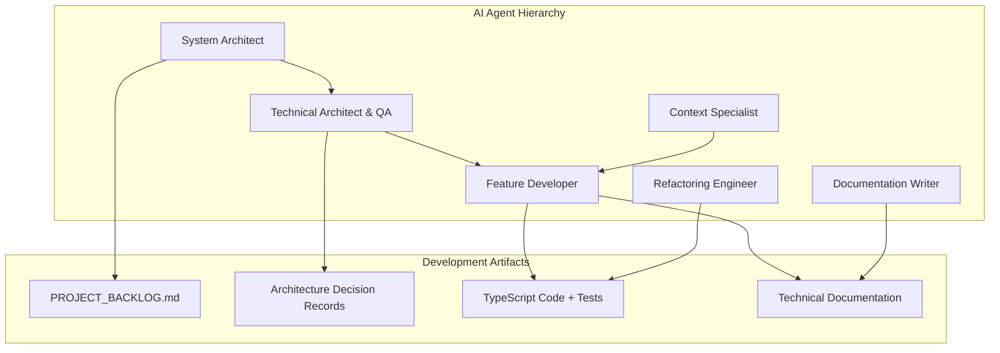
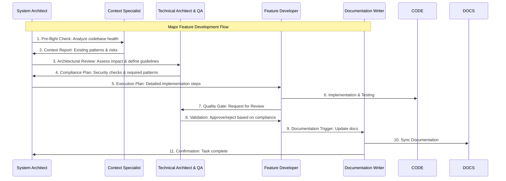

# Agent Coordination Protocols (Demo-Adapted)

This document outlines the coordination and communication protocols for the multi-agent team responsible for the Playable Character Cards project.

---

## 1. Agent Roles & Responsibilities

- **System Architect (Claude 4 Sonnet)**: Strategic planning, task decomposition, and final authority on architectural decisions. Orchestrates the other agents.
- **Technical Architect & QA (Qwen Code)**: Enforces architectural compliance, validates security patterns, and performs quality assurance on all code changes.
- **Context Specialist (Gemini CLI)**: Performs deep codebase analysis, discovers existing patterns, and provides context to other agents to prevent redundant or conflicting work.
- **Feature Developer (Claude 4 Sonnet)**: Implements new features, writes integration tests, and delivers production-ready code according to the plan.
- **Documentation Writer (Claude 4 Sonnet)**: Creates and maintains technical documentation, ensuring it stays synchronized with the codebase using semantic anchors.
- **Refactoring Engineer (Claude 4 Sonnet)**: Improves code quality, reduces technical debt, and performs targeted optimizations without changing functionality.

---

## 2. "Plan, Execute, Verify" Workflow

This workflow ensures that every change is systematic, reviewed, and compliant.

---

## 3. Sequence of Operations & Quality Gates

This sequence diagram illustrates the communication flow and quality gates for a typical feature request.

**Quality Gates:**
- **Architectural Compliance**: `QC` must approve all changes against the defined patterns in `ARCHITECTURE.md`.
- **Security Review**: `QC` validates all changes related to authentication, authorization, and data handling.
- **Documentation Sync**: `DW` ensures documentation is updated before a feature is considered complete.
- **Semantic Anchors**: All documentation must use search patterns (e.g., "search for `functionName`") instead of line numbers to avoid becoming stale.
